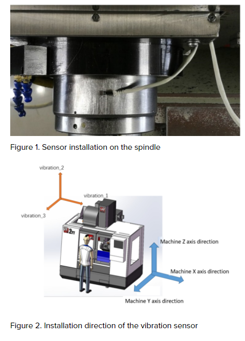
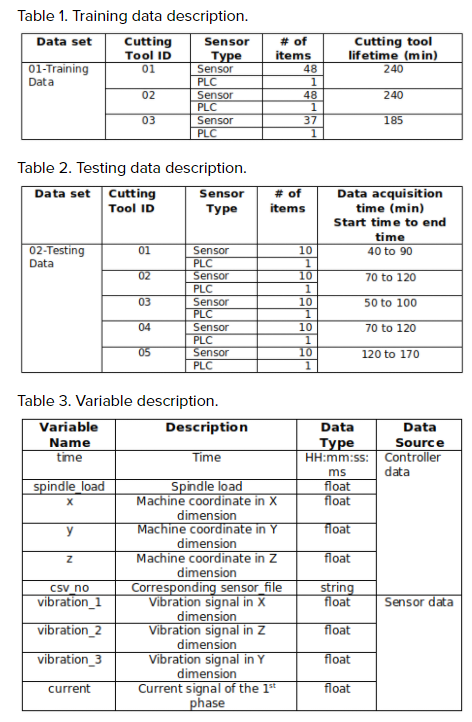

# Foxconn-industrial-AI-Data-Challenge
Based on the CPS architecture, the signals from the controller (PLC) and add-on vibration and current sensors are collected. The goal is to estimate the remaining useful life (RUL) of the cutting tools. The training data is from 3 run-to-failure cutting tools, and their collection starts from normal machining process. The testing data are from 5 cutting tools. In the training data, the whole PLC signal of the machining process are provided. The unit of the timestamp is minutes. Due to the large amount of sensor data, only 1-minute data out of every 5 minutes are provided. The training data are provided in a sequence: 1.csv, 2.csv…. n.csv. The last file is the data collected from the last 5 minutes prior to the end of the experiment. The PLC signal sampling frequency is 33 Hz, and the vibration sensor sampling frequency is 25600 Hz.

1) Sensor Installation

2) Training and Testing Data

This information is provided in the following website:
https://www.iaiinstitute.com/competitions/17/eventData
